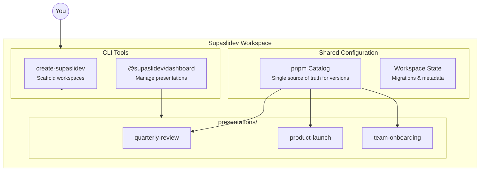

# Introduction

A monorepo toolkit for managing multiple [Slidev](https://sli.dev/) presentations from a single workspace.

::callout{type="info" icon="i-heroicons-light-bulb"}
**Quick summary**: Supaslidev gives you a pnpm workspace with centralized dependency management and an interactive dashboard to create, run, export, and deploy all your Slidev presentations from one place.
::

## The Problem

Creating presentations with Slidev is great—until you have several of them.

Each presentation typically lives in its own folder with its own `package.json`, its own dependency versions, and its own setup. Over time, this leads to:

- **Version drift**: Presentation A runs Slidev 51, Presentation B runs 52, and Presentation C has an outdated theme that breaks with the latest Slidev
- **Repetitive setup**: Every new presentation requires copying configuration files, installing dependencies, and remembering which plugins you used last time
- **Scattered management**: Want to export three presentations to PDF before a conference? Navigate to each folder, run the command, wait, repeat
- **Dependency chaos**: Each `node_modules` folder duplicates the same packages, eating disk space and making updates tedious

If you've ever spent more time managing your presentations than creating them, Supaslidev is for you.

## The Solution

Supaslidev organizes all your presentations in a **pnpm monorepo** with **centralized dependency management** and provides an **interactive dashboard** to manage them.



### How It Works

1. **One workspace, many presentations**: All your presentations live under `presentations/` in a single repository
2. **Shared dependencies**: A pnpm catalog defines dependency versions once—every presentation uses the same Slidev version automatically
3. **Unified commands**: Create, run, export, and deploy any presentation from the workspace root using the dashboard CLI

## Two CLI Tools

Supaslidev consists of two packages that work together:

### create-supaslidev

Scaffolds new workspaces with everything configured:

```bash
pnpm create supaslidev
```

This sets up:
- The workspace directory structure
- `pnpm-workspace.yaml` with catalog dependencies
- Your first presentation
- Git initialization (optional)

### @supaslidev/dashboard

An interactive dashboard and CLI for day-to-day presentation management:

```bash
pnpm dev      # Open the dashboard
pnpm new      # Create a presentation
pnpm present  # Start dev server
pnpm export   # Export to PDF
pnpm deploy   # Build for deployment
```

## What You Get

::list{type="success"}
- **Consistent versions**: Update Slidev once in the catalog, all presentations update together
- **Visual management**: Browse and manage presentations from an interactive dashboard
- **One-command operations**: Export to PDF, build for deployment, or start dev servers without navigating directories
- **Migration system**: Upgrade your workspace when new Supaslidev versions are released
- **Disk efficiency**: pnpm's content-addressable storage means shared packages are stored only once
::

## Next Steps

Ready to get started?

::card-group
::card{icon="i-heroicons-arrow-down-tray" to="/getting-started/installation"}
#title
Installation
#description
Set up your first Supaslidev workspace
::

::card{icon="i-heroicons-folder-open" to="/getting-started/project-structure"}
#title
Project Structure
#description
Understand how the workspace is organized
::
::
