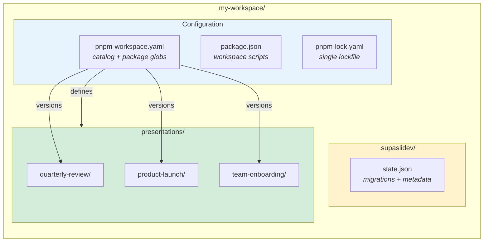

## Workspace Anatomy

A Supaslidev workspace uses a monorepo structure where each presentation is its own package. This diagram shows how the pieces fit together:



## Folder Overview

After creating a workspace with `pnpm create supaslidev`, you'll have the following structure:

```
my-workspace/
├── .supaslidev/           # Workspace state and metadata
│   └── state.json
├── presentations/         # Your Slidev presentations (each is a package)
│   ├── quarterly-review/
│   ├── product-launch/
│   └── team-onboarding/
├── pnpm-workspace.yaml    # Workspace configuration and catalog
├── package.json           # Root package with workspace scripts
└── pnpm-lock.yaml         # Single lockfile for all packages
```

## Presentations as Packages

Each presentation is a standalone pnpm package inside `presentations/`. When you run `pnpm new my-talk`, it creates:

```
presentations/my-talk/
├── slides.md              # Your slide content (main file)
├── package.json           # Package manifest with catalog: dependencies
├── .gitignore             # Ignores build artifacts and caches
├── .npmrc                 # pnpm configuration
├── components/            # Custom Vue components for this deck
├── pages/                 # Multi-file slide pages (optional)
└── snippets/              # Code snippets for slides (optional)
```

### Why Packages?

Treating presentations as packages provides:

::list{type="success"}

- **Isolation**: Each presentation can have unique themes or plugins
- **Shared infrastructure**: All packages share the root `node_modules`
- **Workspace commands**: Use pnpm filters to run commands across presentations
  ::

### Presentation package.json

Each presentation has a minimal `package.json` that references the workspace catalog:

```json
{
  "name": "@supaslidev/my-talk",
  "private": true,
  "type": "module",
  "scripts": {
    "build": "slidev build",
    "dev": "slidev --open",
    "export": "slidev export"
  },
  "dependencies": {
    "@slidev/cli": "catalog:",
    "@slidev/theme-default": "catalog:",
    "vue": "catalog:"
  }
}
```

The `catalog:` specifier tells pnpm to resolve the version from `pnpm-workspace.yaml`. This keeps all presentations on the same dependency versions without duplicating version strings.

## The .supaslidev/ Folder

The `.supaslidev/` directory stores workspace metadata that Supaslidev uses internally:

```
.supaslidev/
└── state.json             # Workspace state
```

### state.json

Tracks the workspace version and applied migrations:

```json
{
  "cliVersion": "0.1.0",
  "createdAt": "2024-01-15T10:30:00.000Z",
  "lastUpdatedAt": "2024-01-15T10:30:00.000Z",
  "appliedMigrations": []
}
```

This file enables the migration system to upgrade your workspace when new Supaslidev versions are released. The CLI reads this file to determine which migrations have been applied and which are pending.

::callout{type="warning" icon="i-heroicons-exclamation-triangle"}
**Commit this file to version control.** It ensures all team members and CI environments have consistent workspace state.
::

## pnpm-workspace.yaml

The workspace configuration file defines which packages belong to the workspace and centralizes dependency versions:

```yaml
packages:
  - 'presentations/*'

catalog:
  '@slidev/cli': ^52.11.3
  '@slidev/theme-default': latest
  '@slidev/theme-seriph': latest
  'vue': ^3.5.26
```

### Workspace Packages

The `packages` array tells pnpm which directories contain workspace packages. The `presentations/*` glob includes all presentation folders. When you add a new folder under `presentations/`, it automatically becomes part of the workspace.

### Catalog Dependencies

The `catalog` section defines shared dependency versions. When a presentation's `package.json` uses `"@slidev/cli": "catalog:"`, pnpm resolves it to the version specified here (`^52.11.3`).

Benefits of catalog dependencies:

::list{type="success"}

- **Consistency**: All presentations use identical dependency versions
- **Single update point**: Upgrade Slidev once in the catalog, and all presentations get the update
- **Reduced lockfile churn**: Fewer version conflicts when adding new presentations
  ::

## Root package.json

The root `package.json` provides workspace-level scripts:

```json
{
  "name": "my-workspace",
  "version": "0.1.0",
  "private": true,
  "type": "module",
  "scripts": {
    "dev": "supaslidev",
    "new": "supaslidev new",
    "present": "supaslidev present",
    "export": "supaslidev export",
    "deploy": "supaslidev deploy"
  },
  "devDependencies": {
    "supaslidev": "^0.1.0"
  },
  "engines": {
    "node": ">=18.0.0"
  }
}
```

These scripts delegate to the `supaslidev` CLI, which handles presentation discovery and execution.

## Generated Directories

These directories are generated during development and builds. They should be in your `.gitignore`:

| Directory                  | Purpose                          |
| -------------------------- | -------------------------------- |
| `node_modules/`            | Installed dependencies           |
| `presentations/*/dist/`    | Built presentation files         |
| `presentations/*/.slidev/` | Slidev cache and temporary files |
| `exports/`                 | PDF exports from presentations   |

## Next Steps

Now that you understand the workspace structure, learn how to [use the dashboard](/concepts/dashboard) to manage your presentations, or dive deeper into [how the monorepo works](/concepts/monorepo).
