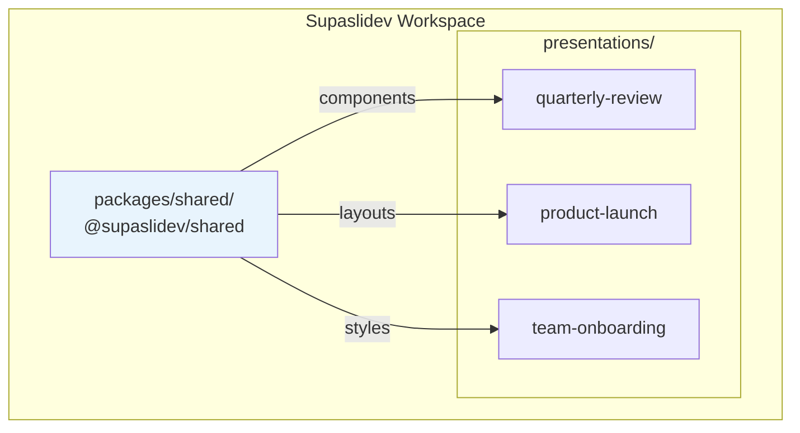

## Overview

The shared package is a local [Slidev addon](https://sli.dev/guide/write-addon) that comes pre-configured in every Supaslidev workspace. It provides a central location for Vue components, layouts, and styles that you want to reuse across multiple presentations.



## How It Works

When you create a new workspace with `pnpm create supaslidev`, a `packages/shared` directory is automatically created with the following structure:

```
packages/shared/
├── components/          # Vue components (auto-imported)
│   └── SharedBadge.vue  # Example component
├── layouts/             # Custom slide layouts
├── styles/              # Global styles
├── package.json         # Configured as a Slidev addon
├── tsconfig.json
└── README.md
```

The package is configured as a Slidev addon via the `slidev-addon` keyword in its `package.json`. Slidev automatically discovers and imports resources from these directories.

## Using Shared Components

Every new presentation is pre-configured to use the shared package. The addon is declared in the presentation's `slides.md` frontmatter:

```yaml
---
theme: default
title: My Presentation
addons:
  - '@supaslidev/shared'
---
```

Components from the shared package are immediately available in your slides without any import statements:

```md
# Welcome

<SharedBadge>New Feature</SharedBadge>

This badge component is defined once and used everywhere.
```

## Creating Shared Components

Add a new `.vue` file to `packages/shared/components/`:

```vue
<!-- packages/shared/components/CompanyLogo.vue -->
<script setup lang="ts">
defineProps<{
  size?: 'sm' | 'md' | 'lg';
}>();
</script>

<template>
  
</template>

<style scoped>
.company-logo--sm { width: 32px; }
.company-logo--md { width: 64px; }
.company-logo--lg { width: 128px; }
</style>
```

The component is immediately available in all presentations:

```md
# About Us

<CompanyLogo size="lg" />
```

## Creating Shared Layouts

Layouts define the structure of entire slides. Add a `.vue` file to `packages/shared/layouts/`:

```vue
<!-- packages/shared/layouts/branded.vue -->
<template>
  <div class="slidev-layout branded">
    <header>
      <CompanyLogo size="sm" />
    </header>
    <slot />
    <footer>
      <span>© 2024 Your Company</span>
    </footer>
  </div>
</template>

<style scoped>
.branded {
  display: flex;
  flex-direction: column;
  height: 100%;
}
header, footer {
  padding: 1rem;
}
</style>
```

Use the layout in your slides:

```md
---
layout: branded
---

# Slide with Branded Layout

Content appears between the header and footer.
```

## Creating Shared Styles

Add CSS files to `packages/shared/styles/` for global styles:

```css
/* packages/shared/styles/index.css */
:root {
  --brand-primary: #3b82f6;
  --brand-secondary: #1e40af;
}

.highlight {
  color: var(--brand-primary);
  font-weight: 600;
}
```

Import the styles in your presentation's frontmatter or include them in a component.

## Auto-Configuration for New Presentations

When you create a new presentation with `pnpm new`, the shared addon is automatically configured:

- The presentation's `package.json` includes `"@supaslidev/shared": "workspace:*"` as a dependency
- The `slides.md` frontmatter includes `addons: ['@supaslidev/shared']`

## Auto-Configuration for Imported Presentations

When you import an existing Slidev presentation with `pnpm supaslidev import`, Supaslidev automatically:

1. Adds `@supaslidev/shared` as a workspace dependency
2. Updates the `slides.md` frontmatter to include the addon

If the presentation already has other addons configured, `@supaslidev/shared` is appended to the existing list.

## The SharedBadge Example

Every new workspace includes a `SharedBadge` component as an example:

```vue
<template>
  <span class="shared-badge">
    <slot />
  </span>
</template>

<style scoped>
.shared-badge {
  display: inline-block;
  padding: 0.25rem 0.5rem;
  border-radius: 0.25rem;
  background-color: var(--slidev-theme-primary, #3b82f6);
  color: white;
  font-size: 0.875rem;
  font-weight: 500;
}
</style>
```

Use it in any presentation:

```md
<SharedBadge>Beta</SharedBadge>
<SharedBadge>Coming Soon</SharedBadge>
```

## Directory Conventions

Slidev recognizes these directories in addons:

| Directory    | Purpose                          | Auto-imported |
| ------------ | -------------------------------- | ------------- |
| components/  | Vue components                   | Yes           |
| layouts/     | Slide layouts                    | Yes           |
| styles/      | CSS/SCSS files                   | No            |
| public/      | Static assets (images, fonts)    | Yes           |

## When to Use Shared vs Local

**Use the shared package for:**

- Branding elements (logos, colors, typography)
- Reusable UI components (badges, callouts, code blocks)
- Standard layouts (title slides, section dividers)
- Company-wide styles and themes

**Use presentation-local components for:**

- Content specific to one presentation
- Experimental components you're still developing
- Overrides of shared components for a specific deck

## Next Steps

::card-group
::card{icon="i-heroicons-document-text" to="/getting-started/project-structure"}
#title
Project Structure
#description
See where the shared package fits in the workspace
::

::card{icon="i-heroicons-arrow-down-on-square" to="/features/import"}
#title
Import Presentations
#description
Learn how imports auto-configure the shared addon
::
::
