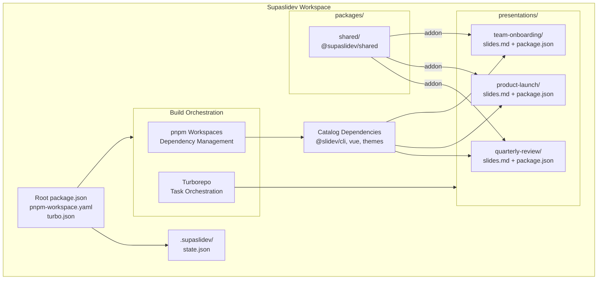

## Why a Monorepo?

Managing presentations as separate projects creates friction:

- **Duplicated effort**: Installing dependencies, configuring tools, and updating versions happens per-project
- **Version inconsistency**: Different presentations end up on different Slidev versions, leading to subtle bugs and incompatibilities
- **Scattered tooling**: No central place to run commands across all presentations

A monorepo consolidates everything into a single repository while keeping presentations independent. You get shared infrastructure without coupling your content.

## Architecture Overview

The following diagram shows how a Supaslidev workspace is structured:



## Benefits of This Approach

### Shared Dependencies

All presentations share a single `node_modules` at the workspace root. pnpm's content-addressable storage ensures packages are only stored once on disk, even across hundreds of presentations.

### Consistent Tooling

Linting, formatting, and build configurations live in one place. When you update a tool, all presentations benefit immediately.

### Atomic Updates

Upgrading Slidev happens once in the catalog. Every presentation gets the new version on the next `pnpm install`, reducing the risk of forgotten or partially-updated projects.

### Simplified CI/CD

One repository means one pipeline. Build and deploy any combination of presentations from a single workflow.

## pnpm Workspace Configuration

The workspace is defined in `pnpm-workspace.yaml` at the repository root:

```yaml
packages:
  - 'packages/*'
  - 'presentations/*'

catalog:
  '@slidev/cli': ^52.11.3
  '@slidev/theme-default': latest
  '@slidev/theme-seriph': latest
  'vue': ^3.5.26
```

### The packages Array

The `packages` array tells pnpm which directories contain workspace packages. The glob `packages/*` includes shared packages like `@supaslidev/shared`, while `presentations/*` includes every presentation folder as a separate package.

When you create a new presentation with `pnpm new my-talk`, it becomes part of the workspace automatically and is pre-configured to use the shared package as a Slidev addon.

### Understanding Catalog Dependencies

The `catalog` section is the key to consistent versioning. It defines named versions that presentations reference using the special `catalog:` specifier.

In a presentation's `package.json`:

```json
{
  "dependencies": {
    "@slidev/cli": "catalog:",
    "@slidev/theme-default": "catalog:",
    "@supaslidev/shared": "workspace:*",
    "vue": "catalog:"
  }
}
```

When pnpm resolves `"@slidev/cli": "catalog:"`, it looks up `@slidev/cli` in the workspace catalog and uses that version (`^52.11.3`). The `"workspace:*"` specifier links to the local shared package. This creates a single source of truth for dependency versions.

### Updating Catalog Versions

To upgrade Slidev across all presentations:

1. Edit `pnpm-workspace.yaml`:

```yaml
catalog:
  '@slidev/cli': ^53.0.0 # Updated version
```

2. Run `pnpm install` to apply the change:

```bash
pnpm install
```

Every presentation now uses the new version. The lockfile updates to reflect the change, and you can verify everything works before committing.

## Turborepo Integration

While pnpm handles dependency management, [Turborepo](https://turbo.build/) orchestrates task execution across the workspace. It provides intelligent caching and parallel execution that dramatically speeds up builds, tests, and other operations.

### How Turborepo Helps

**Parallel Execution**: Turborepo analyzes task dependencies and runs independent tasks concurrently. Building ten presentations happens in parallel rather than sequentially.

**Intelligent Caching**: When you run a task, Turborepo hashes the inputs (source files, dependencies, environment). If nothing changed since the last run, it replays the cached output instantly.

**Dependency Awareness**: Tasks can declare dependencies on other tasks. Building a presentation automatically ensures its dependencies are built first.

### Configuration

Turborepo configuration lives in `turbo.json` at the workspace root:

```json
{
  "$schema": "https://turbo.build/schema.json",
  "tasks": {
    "build": {
      "dependsOn": ["^build"],
      "inputs": ["src/**", "**/*.ts", "**/*.vue", "package.json"],
      "outputs": ["dist/**"]
    },
    "dev": {
      "cache": false,
      "persistent": true
    }
  }
}
```

Key configuration options:

- **dependsOn**: `["^build"]` means this task waits for dependencies' build tasks to complete first
- **inputs**: Files that affect the task output (used for cache invalidation)
- **outputs**: Directories/files produced by the task (cached between runs)
- **cache**: Set to `false` for tasks that shouldn't be cached (like dev servers)
- **persistent**: Marks long-running tasks that don't exit

### Running Tasks with Turborepo

The root `package.json` provides scripts that use Turborepo:

```bash
# Build all packages in parallel
pnpm build:all

# Run linting across all packages
pnpm lint

# Type-check all packages
pnpm typecheck

# Run all tests
pnpm test:ci
```

These commands leverage Turborepo's parallelization and caching. After the first run, subsequent runs skip unchanged packages entirely.

### Cache Behavior

Turborepo stores task outputs locally in `node_modules/.cache/turbo`. When a task runs:

1. Turborepo computes a hash from the task's inputs
2. If a cached result exists for that hash, it restores the outputs and replays the logs
3. If no cache exists, the task runs normally and the result is cached

You can see cache hits in the output:

```
@supaslidev/quarterly-review:build: cache hit, replaying logs
@supaslidev/product-launch:build: cache miss, executing task
```

To clear the cache and force a full rebuild:

```bash
pnpm build:all --force
```

## Adding Presentations

Create a new presentation using the dashboard CLI:

```bash
pnpm new my-new-talk
```

This command:

1. Creates `presentations/my-new-talk/` with the standard structure
2. Generates a `package.json` using catalog dependencies
3. Creates a starter `slides.md` file
4. Runs `pnpm install` to link the new package

You can also create presentations manually. Create the folder structure and ensure the `package.json` uses `catalog:` and `workspace:` specifiers:

```bash
mkdir -p presentations/manual-talk
```

```json
{
  "name": "@supaslidev/manual-talk",
  "private": true,
  "type": "module",
  "scripts": {
    "build": "slidev build",
    "dev": "slidev --open",
    "export": "slidev export"
  },
  "dependencies": {
    "@slidev/cli": "catalog:",
    "@slidev/theme-default": "catalog:",
    "@supaslidev/shared": "workspace:*",
    "vue": "catalog:"
  }
}
```

Don't forget to add the shared addon to your `slides.md` frontmatter:

```yaml
---
addons:
  - '@supaslidev/shared'
---
```

Then run `pnpm install` to add it to the workspace.

## Removing Presentations

To remove a presentation from the workspace:

1. Delete the presentation folder:

```bash
rm -rf presentations/old-talk
```

2. Clean up the lockfile:

```bash
pnpm install
```

pnpm automatically removes the package from the workspace and updates `pnpm-lock.yaml`.

If you want to archive a presentation without deleting it, move it outside the `presentations/` directory. Since it no longer matches the workspace glob, pnpm treats it as a regular folder.

## Running Commands Across Presentations

pnpm provides filtering to run commands on specific packages or all packages matching a pattern.

### All Presentations

Build every presentation:

```bash
pnpm --filter '@supaslidev/*' run build
```

### Specific Presentation

Start the dev server for one presentation:

```bash
pnpm --filter @supaslidev/my-talk run dev
```

Or use the dashboard CLI:

```bash
pnpm present my-talk
```

### Multiple Presentations

Run commands on a subset:

```bash
pnpm --filter '@supaslidev/quarterly-*' run build
```

## Workspace Structure Recap

A typical Supaslidev workspace looks like this:

```
my-workspace/
├── packages/
│   └── shared/              # Shared components, layouts, styles
│       ├── components/
│       ├── layouts/
│       ├── styles/
│       └── package.json     # Configured as Slidev addon
├── presentations/
│   ├── quarterly-review/
│   │   ├── slides.md
│   │   └── package.json     # Uses catalog: and workspace: dependencies
│   ├── product-launch/
│   │   ├── slides.md
│   │   └── package.json
│   └── team-onboarding/
│       ├── slides.md
│       └── package.json
├── .supaslidev/
│   └── state.json           # Workspace metadata
├── pnpm-workspace.yaml      # Workspace config and catalog
├── package.json             # Root package
└── pnpm-lock.yaml           # Single lockfile for all packages
```

Key points:

- Each presentation is a separate pnpm package with its own `package.json`
- All presentations share dependencies through the catalog
- The shared package provides reusable components, layouts, and styles across all presentations
- A single `pnpm-lock.yaml` locks versions for the entire workspace
- The `.supaslidev/` folder tracks workspace state for migrations

## Next Steps

Learn more about the [CLI commands](/reference/cli-commands) for managing presentations, or explore the [dashboard features](/features/dashboard) for an interactive workflow.
